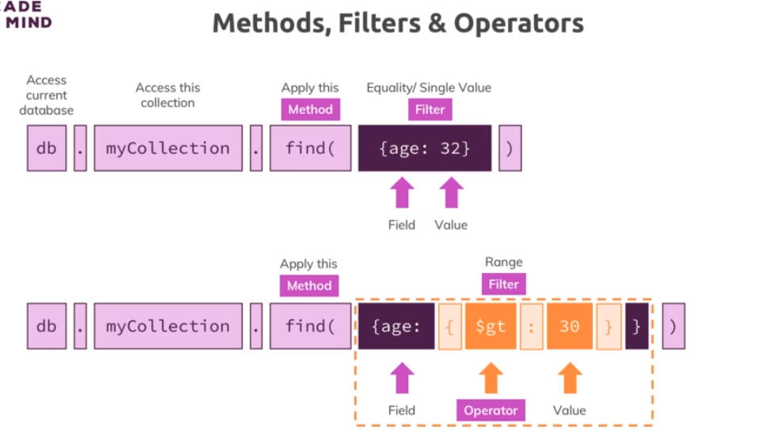
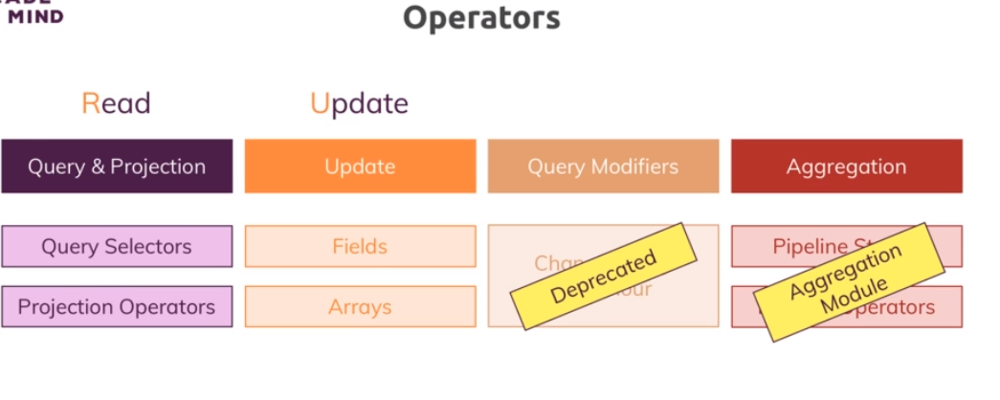
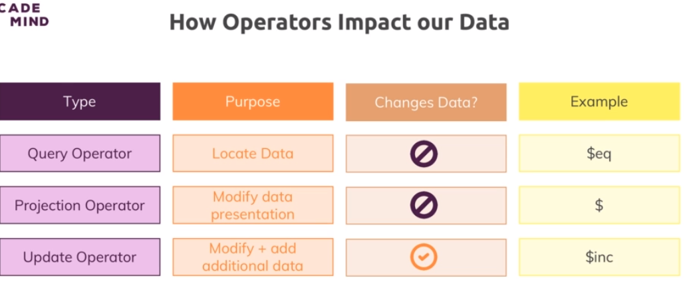
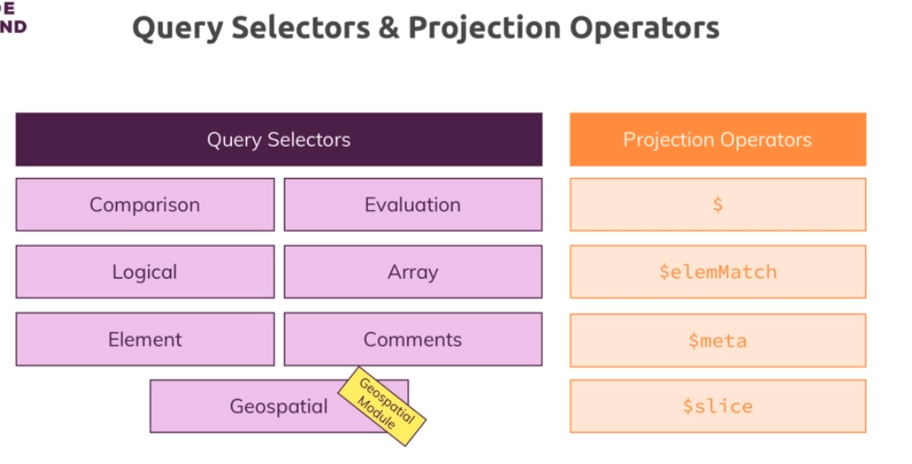
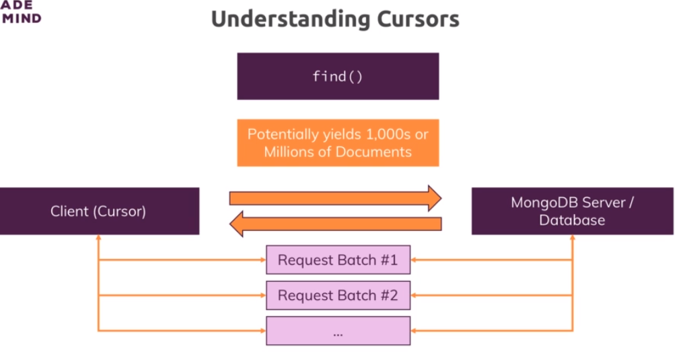

# 5-Read-Operations

1. [Intro](#schema1)
2. [Understanding findOne() & find()](#schema2)
3. [Working with Comparison Operators.](#schema3)
4. [Querying Embedded Fields & Arrays](#schema4)
5. [Diving Deeper Into Querying Arrays](#schema5)
6. [Understanding Cursors](#schema6)
7. [Sorting, Skipping & Limiting Cursors Results](#schema7)
8. [Using Projection to Shape our Results](#schema8)
9. [Understanding $slice](#schema9)


<hr>

<a name="schema1"></a>

## 1. Intro
!~~[read](./img/1read.png)







<hr>

<a name="schema2"></a>

## 2. Understanding findOne() & find()

En MongoDB, findOne y find son métodos utilizados para realizar consultas en una colección,
pero tienen diferencias clave en cómo devuelven los resultados:

**findOne:**

findOne se utiliza para recuperar un solo documento que coincida con los criterios de consulta especificados.
Devuelve un solo documento, o null si no se encuentra ninguna coincidencia.
Si hay varias coincidencias, findOne devuelve solo el primer documento que cumple con los criterios de consulta.
Ejemplo:

```
db.miColeccion.findOne({ campo: 'valor' });
```
Este ejemplo devolverá el primer documento de la colección miColeccion donde el campo sea igual a 'valor', 
o null si no se encuentra ninguna coincidencia.

**find:**

find se utiliza para recuperar un conjunto de documentos que coinciden con los criterios de consulta especificados.
Devuelve un cursor, que es un puntero a los documentos en la colección que cumplen con los criterios de consulta.
Puedes iterar sobre el cursor para acceder a todos los documentos que coinciden con la consulta.
Ejemplo:

```
const cursor = db.miColeccion.find({ campo: 'valor' });
cursor.forEach(document => {
  // Operaciones con cada documento que cumple con la consulta
});
```

Este ejemplo devuelve un cursor que apunta a todos los documentos en la colección miColeccion donde el campo es igual 
a 'valor'. Luego, puedes usar un bucle para iterar sobre los documentos y realizar operaciones con cada uno de ellos.

En resumen, findOne se utiliza cuando solo estás interesado en el primer documento que cumple con los criterios 
de consulta, mientras que find se utiliza cuando deseas obtener un conjunto de documentos que cumplen con 
los criterios y necesitas iterar sobre ellos. Ambos métodos son poderosos y se utilizan según los requisitos 
específicos de la aplicación.


<hr>

<a name="schema3"></a>

## 3. Working with Comparison Operators.

**Operadores de Comparación:**

- $eq: Igual a
- $ne: No igual a
- $lt: Menor que
- $lte: Menor o igual a
- $gt: Mayor que
- $gte: Mayor o igual a

```
db.movies.find({runtime:{$ne:60}}).pretty()
```
**Operadores Lógicos:**

- $and: Cumple con todos los criterios
- $or: Cumple con al menos uno de los criterios
- $not: No cumple con el criterio especificado
- $nor: No cumple con ninguno de los criterios

```
movieData> db.movies.findOne({runtime:{$in:[30,42]}})
```
```
movieData> db.movies.find({$or:[{"rating.average":{$lt:5}},{"rating.average":{$gt:9.3}}]})
```
```
movieData> db.movies.find({"rating.average":{$gt:9},genres:'Drama'}).count()
3
movieData> db.movies.find({$and:[{"rating.average":{$gt:9}},{genres:'Drama'}]}).count()
3
```
```
movieData> db.movies.find({runtime:{$ne:60}}).count()
70
movieData> db.movies.find({runtime:{$not:{$eq:60}}}).count()
70
```

**Otros Operadores:**

- $in: Coincide con alguno de los valores especificados en un array

- $nin: No coincide con ninguno de los valores especificados en un array

- $exists: Coincide con documentos que contienen o no contienen un campo específico
- $type: se utiliza para realizar consultas basadas en el tipo de datos de un campo en un documento. 
Permite buscar documentos donde un campo específico tenga un tipo de datos particular.
  - 1: Double (número de coma flotante)
  - 2: String (cadena de texto)
  - 3: Object (objeto BSON)
  - 4: Array (arreglo)
  - 8: Boolean (booleano)
  - 16: Integer (entero)
  - 17: Timestamp
  - 18: Long (entero largo)
  - Date: Date (fecha)
```
movieData> db.movies.find({runtime:{$type:'number'}}).count()
240

```
```
movieData> db.movies.find({name:{$exists: true,$eq:'Under the Dome'}})
```

**Evaluation Query Operators**

- $expr: Permite el uso de expresiones de agregación dentro del lenguaje de consulta.
- $jsonSchema: Valida documentos contra el JSON Schema proporcionado.
- $mod: Realiza una operación de módulo en el valor de un campo y selecciona documentos con un resultado específico.
- $regex: Selecciona documentos donde los valores coinciden con una expresión regular especificada.
- $text: Realiza búsquedas de texto.
- $where: Encuentra documentos que satisfacen una expresión JavaScript.

```
movieData> db.movies.find({summary:{$regex:/music/}}).count()
5

```


<hr>

<a name="schema4"></a>

## 4. Querying Embedded Fields & Arrays

Como vemos en este caso `rating: { average: 6.5 },` tenemos datos anidados.
A ver como sería la query para obtener ese valor.

```
movieData> db.movies.findOne()
{
  _id: ObjectId('6565bd02f59902f29c66619f'),
  id: 1,
  url: 'http://www.tvmaze.com/shows/1/under-the-dome',
  name: 'Under the Dome',
  type: 'Scripted',
  language: 'English',
  genres: [ 'Drama', 'Science-Fiction', 'Thriller' ],
  status: 'Ended',
  runtime: 60,
  premiered: '2013-06-24',
  officialSite: 'http://www.cbs.com/shows/under-the-dome/',
  schedule: { time: '22:00', days: [ 'Thursday' ] },
  rating: { average: 6.5 },
  weight: 91,
  network: {
    id: 2,
    name: 'CBS',
    country: { name: 'United States', code: 'US', timezone: 'America/New_York' }
  },
  webChannel: null,
  externals: { tvrage: 25988, thetvdb: 264492, imdb: 'tt1553656' },
  image: {
    medium: 'http://static.tvmaze.com/uploads/images/medium_portrait/0/1.jpg',
    original: 'http://static.tvmaze.com/uploads/images/original_untouched/0/1.jpg'
  },
  summary: "<p><b>Under the Dome</b> is the story of a small town that is suddenly and inexplicably sealed off from the rest of the world by an enormous transparent dome. The town's inhabitants must deal with surviving the post-apocalyptic conditions while searching for answers about the dome, where it came from and if and when it will go away.</p>",
  updated: 1529612668,
  _links: {
    self: { href: 'http://api.tvmaze.com/shows/1' },
    previousepisode: { href: 'http://api.tvmaze.com/episodes/185054' }
  }
}
```
Sería `rating.average` porque los datos están así en la bbdd `rating: { average: 6.5 },`

```
movieData> db.movies.find({"rating.average":{$gt:7}})
```
Pero en cambio es el caso de `genres` los datos son un array `genres: [ 'Drama', 'Science-Fiction', 'Thriller' ]` y la
query sería asi: 

```
movieData> db.movies.findOne({genres:['Drama']})

```

<hr>

<a name="schema5"></a>

## 5. Diving Deeper Into Querying Arrays

```
db.users.find({"hobbies.title":"Sports"})
```
Aquí hay algunos de los query selectors comunes para consultas con array:

- $elemMatch: Se utiliza para buscar documentos que contienen al menos un elemento que coincide con todos 
los criterios de consulta dentro del arreglo.

```
// Encuentra documentos donde al menos un elemento del arreglo "etiquetas" es "rojo" y "grande".
db.collection.find({ etiquetas: { $elemMatch: { $eq: "rojo", $eq: "grande" } } });
```

- $size: Se utiliza para buscar documentos cuyo arreglo tiene un tamaño específico.

```
// Encuentra documentos donde el tamaño del arreglo "colores" es 3.
db.collection.find({ colores: { $size: 3 } });
```

- $all: Se utiliza para buscar documentos donde todos los elementos del arreglo coinciden con los valores especificados.

```
// Encuentra documentos donde todos los elementos del arreglo "etiquetas" son "rojo" y "verde".
db.collection.find({ etiquetas: { $all: ["rojo", "verde"] } });
```

- $in: Se utiliza para buscar documentos donde al menos un elemento del arreglo coincide con al menos uno de los 
valores especificados.
```
// Encuentra documentos donde al menos un elemento del arreglo "etiquetas" es "rojo" o "azul".
db.collection.find({ etiquetas: { $in: ["rojo", "azul"] } });
```

- $nin: Se utiliza para buscar documentos donde ningún elemento del arreglo coincide con ninguno de los 
valores especificados.

javascript
Copy code
// Encuentra documentos donde ningún elemento del arreglo "etiquetas" es "amarillo" ni "verde".
db.collection.find({ etiquetas: { $nin: ["amarillo", "verde"] } });


<hr>

<a name="schema6"></a>

## 6. Understanding Cursors




```
const dataCursor = db.movies.find()
dataCursor.next()
```

Cada vez que ejecutamos `dataCursor.next()` nos da un valor distinto porque el cursor apunta a otro elemento.

Podemos usar funciones cuando tenemos creado el cursor como por ejemplo:
```
movieData> dataCursor.forEach(doc => {printjson(doc)})
```
Al terminar de la ejecuación anterior, si volvemos a ejecutar `dataCursor.next()` se produce el siguiente error.

```
movieData> dataCursor.next()
MongoCursorExhaustedError: Cursor is exhausted
```

Este error indica que has intentado avanzar en un cursor que ya ha alcanzado el final de los resultados. Para evitar 
este error, debes verificar si hay documentos disponibles antes de intentar obtener el siguiente. Puedes hacer esto 
utilizando el método hasNext() del cursor para comprobar si hay más documentos disponibles antes de llamar a next()
```
movieData> dataCursor.hasNext()
false
```

<hr>

<a name="schema5"></a>

## 7. Sorting, Skipping & Limiting Cursors Results

- Sorting

En MongoDB, el método .sort() se utiliza para ordenar los resultados de una consulta en función de uno o 
más campos. Puedes usarlo tanto en consultas de búsqueda como en consultas de agregación.

La sintaxis básica es la siguiente:

```
db.collection.find().sort({ campo: 1 }); // Orden ascendente
db.collection.find().sort({ campo: -1 }); // Orden descendente
```

Donde campo es el nombre del campo por el cual deseas ordenar, y el valor 1 indica orden ascendente, 
mientras que -1 indica orden descendente.


- Skipping
El término "skipping" se refiere a la acción de omitir un número específico de documentos al realizar una consulta. 
Puedes utilizar el método `.skip()` para indicar cuántos documentos deseas omitir antes de comenzar a devolver 
resultados. Esto es comúnmente utilizado para la paginación de resultados.

La sintaxis básica de .skip() es la siguiente:

```
db.collection.find().skip(numeroDeDocumentos);
```

Donde numeroDeDocumentos es la cantidad de documentos que deseas omitir antes de comenzar a recuperar resultados.

- Limiting

La acción de limitar el número de documentos devueltos en una consulta se realiza mediante el método `.limit().` 
Este método se utiliza para especificar el límite superior en la cantidad de documentos que deseas recuperar.

La sintaxis básica de .limit() es la siguiente:

```
db.collection.find().limit(numeroDeDocumentos);
```

Donde numeroDeDocumentos es la cantidad máxima de documentos que deseas recuperar.


<hr>

<a name="schema8"></a>

## 8. Using Projection  our Results


La proyección en MongoDB se refiere a la selección y exclusión de campos específicos en los resultados de una 
consulta. La proyección te permite limitar los campos que se devuelven en los documentos recuperados, lo que puede 
ser útil para reducir el tamaño de los resultados y mejorar el rendimiento de la consulta.

- Datos anidados
```
movieData> db.movies.find({},{name:1,genres:2,runtime:1,rating:1}).pretty()
[
  {
    _id: ObjectId('6565bd02f59902f29c66619f'),
    name: 'Under the Dome',
    genres: [ 'Drama', 'Science-Fiction', 'Thriller' ],
    runtime: 60,
    rating: { average: 6.5 }
  },

```

En este ejemplo, se incluyen solo los campos "name","runtime","rating" y "genres" en los resultados. 
El campo _id se excluye explícitamente utilizando { _id: 0 }.
```
movieData> db.movies.find({},{name:1,genres:2,runtime:1,rating:1,_id:0}).pretty()
[
  {
    name: 'Under the Dome',
    genres: [ 'Drama', 'Science-Fiction', 'Thriller' ],
    runtime: 60,
    rating: { average: 6.5 }
  },
```
Pero como hacemos para solo obtener el valor de un dato anidado.

```
movieData> db.movies.find({},{name:1,genres:2,runtime:1,"rating.average":1,"schedule.time":1,_id:0}).pretty()
[
  {
    name: 'Under the Dome',
    genres: [ 'Drama', 'Science-Fiction', 'Thriller' ],
    runtime: 60,
    schedule: { time: '22:00' },
    rating: { average: 6.5 }
  },

```
- Datos con arrays
```
movieData> db.movies.find({genres:'Drama'},{name:1,"genres.$":1,runtime:1,"rating.average":1,_id:0}).pretty()
[
  {
    name: 'Under the Dome',
    genres: [ 'Drama' ],
    runtime: 60,
    rating: { average: 6.5 }
  },

```
la siguiente proyección parece estar limitando la presentación de los campos. 
En particular, la proyección `"genres.$": 1` solicita solo el primer elemento del array genres que 
coincida con la condición. En el ejemplo proporcionado, el documento devuelto tiene "genres": ["Horror"].

```
movieData> db.movies.find({genres:{$all:['Drama','Horror']}},{name:1,"genres.$":1,runtime:1,"rating.average":1,_id:0})
[
  {
    name: 'Bitten',
    genres: [ 'Horror' ],
    runtime: 60,
    rating: { average: 7.6 }
  }
```

<hr>

<a name="schema9"></a>

## 9. Understanding $slice

El operador $slice en MongoDB se utiliza para limitar el número de elementos en un array que se devuelve en una 
consulta. Puedes usarlo para seleccionar un subconjunto específico de elementos de un array.

```
movieData> db.movies.find( { genres: { $all: ['Drama', 'Horror'] } }, { name: 1, genres: { $slice: 2 }, runtime: 1, "rating.average": 1, _id: 0 } ).limit(5).pretty();
[
  {
    name: 'Bitten',
    genres: [ 'Drama', 'Horror' ],
    runtime: 60,
    rating: { average: 7.6 }
  },

```


